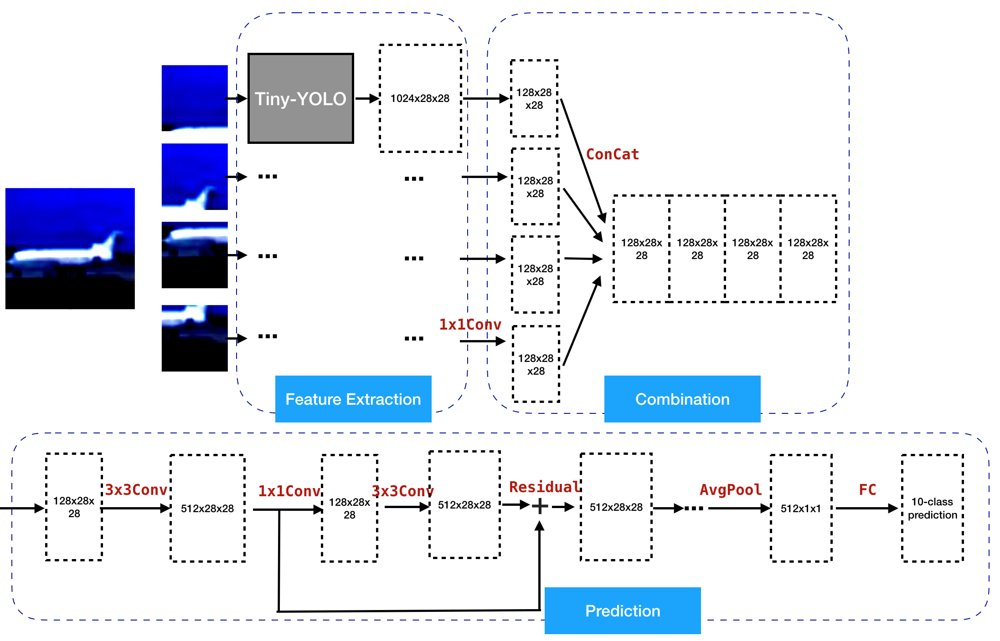

# yolo-tile
## Introduction
The goal of this project is to design a Deep Convolutional Neural Network (DCNN) that can receive an image in very high resolution. However, memory requirement is the major obstacle since the larger the image size is, the larger the immediate filter maps are. To overcome this, the image is cut into tiles and each tile is processed by a light-weight DCNN. The results from the light-weight DCNN are then concatenated and put into another DCNN to produce a final prediction.

We tested this idea on CIFAR-10, an image classification dataset with 10,000 training samples and 2,000 testing samples. The images from CIFAR-10 are upscaled from 32x32 to 768x768 resolution. In our implementation, the network receives 2x2 tiles from input images. However, the model can work with any other tile-configuration with minor modification.

## Evaluation
We compare our tile-based network with a tiny-YOLO on the CIFAR-10 dataset. There is a few percentage drop of accuracy when going from 1x1 to 2x2 tiles compared with tiny-YOLO, and a little bit more drop when going up to 4x4 tiles. We are working to reduce this drop for large number of tiles.

| Model               | CIFAR-10 acc  |
| ------------------- | ------------- |
| tiny-YOLO 416x416   | 88%           |
| tile-2x2            | 86%           |
| tile-4x4            | 81%           |
